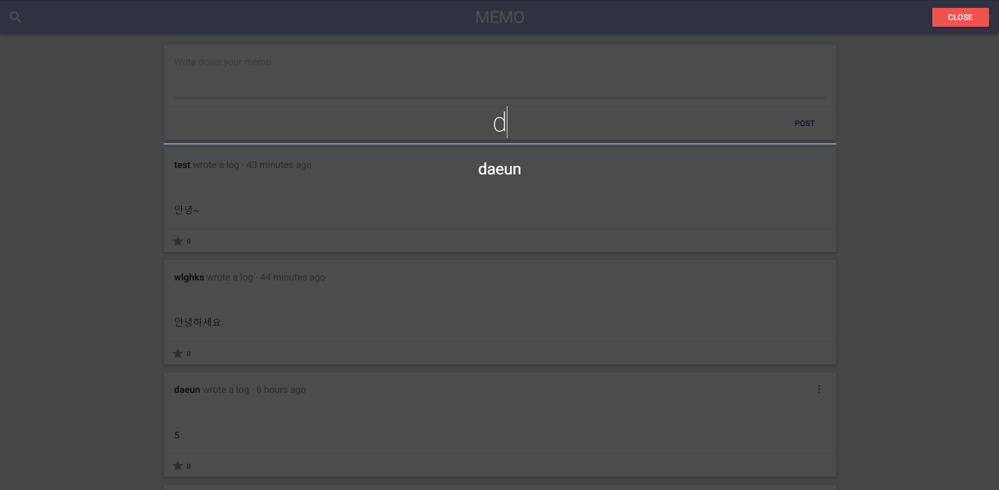

# MemoApp

https://velopert.com/tag/reactcodelab

## Stack

- React JS
- Node JS (Express)
- MongoDB / Mongoose
- Materialize CSS
- Axios for API requests

## Features

- 로그인 시 session 활용
- 회원가입
- Memo 작성, 수정, 삭제, 별 주기
- Memo 무한 스크롤링
- User 찾기 기능 및 User Memo 불러오기
- Animation

## Run Project

### Local Dependency 및 Global Dependency 설치

```bash
npm install -g webpack webpack-dev-server babel-cli nodemon cross-env
npm install
```

### Project 실행하기

```bash
npm run build
npm run development or npm run start
```

## Screenshot

### Home

</img>

### Login & Register

</img>
</img>

### Search

</img>

### Wall

</img>
